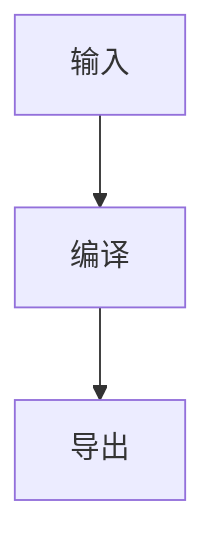

# 编译器内核

这是一份包含中文、英文、表格、脚注和代码的综合 fixture。[^compiler]

## GFM 内容

| 能力 | 状态 |
| ---- | ---- |
| 表格 | ✅   |
| 脚注 | ✅   |

:::tip{title="提示"}
危险的 URL 会被拒绝，原始 HTML 不会进入输出。
:::


```ts
export const stable = true;
```

行内公式 $E = mc^2$，以及一个静态图表：



::pagebreak

## 附录

[^compiler]: P1 编译器内核回归 fixture。
