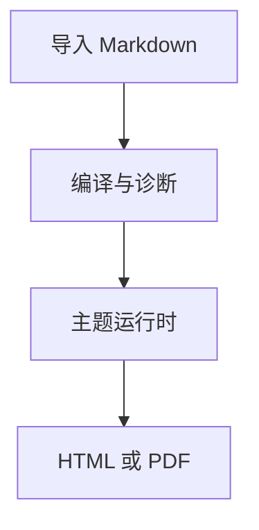

# 主题验收样张

这是一份统一的主题验收文档，用来观察中文标点、英文混排、标题节奏、页内留白和长内容的稳定性。

> The same semantic document must keep its hierarchy when it moves from HTML to paged output.

:::tip{title="阅读提示"}
所有官方主题都消费同一份语义 HTML；差异来自 tokens、内容层、屏幕层和打印层。
:::

## 目录与章节

主题应保留目录层级，并让章节标题避免出现在页面底部。下面的内容有意包含较长标题和不同密度的段落。

### 中文与 English 混排的长标题示例

MarkdownMint turns a finished Markdown document into a shareable artifact without moving the
author into a template editor.

#### 章节中的第四级标题

##### 章节中的第五级标题

###### 章节中的第六级标题

### 列表、引用与分页

- 第一层列表项目包含中文说明和 `inline code`。
  - 第二层列表项目用于检查缩进和换行。
  - 第二层列表项目包含一个 [安全链接](https://example.com/docs)。
  - 长链接应安全换行：[https://example.com/markdown-mint/acceptance/very-long-documentation-path/with-a-stable-anchor-for-print-review](https://example.com/markdown-mint/acceptance/very-long-documentation-path/with-a-stable-anchor-for-print-review)
- 最后一项保持和上一项相同的行距。

1. 先编译 Markdown。
2. 再应用主题合同。
3. 最后生成 PDF 或独立 HTML。

::pagebreak

## 复杂内容

### 宽表格与长文本

| 组件 | 预期行为                 | 验收要点             | English note               |
| ---- | ------------------------ | -------------------- | -------------------------- |
| 表格 | 表头在打印分页后保持可见 | 宽内容不应让正文溢出 | repeated table headers     |
| 代码 | 语法高亮保持静态         | 长行可滚动或安全换行 | deterministic highlighting |
| 图表 | SVG 不执行脚本           | 标签和边界可读       | sanitized Mermaid SVG      |
| 公式 | 数学结构可复制           | 显示公式不切断       | static KaTeX output        |

### 代码与公式

```ts
export function chooseOutput(format: "html" | "pdf"): string {
  return format === "pdf" ? "paged-media" : "standalone-html";
}
```

下面的长代码块用于检查高亮、长文档分页和连续行的视觉稳定性：

```ts
const fixtureLine001 = "deterministic sample line 001";
const fixtureLine002 = "deterministic sample line 002";
const fixtureLine003 = "deterministic sample line 003";
const fixtureLine004 = "deterministic sample line 004";
const fixtureLine005 = "deterministic sample line 005";
const fixtureLine006 = "deterministic sample line 006";
const fixtureLine007 = "deterministic sample line 007";
const fixtureLine008 = "deterministic sample line 008";
const fixtureLine009 = "deterministic sample line 009";
const fixtureLine010 = "deterministic sample line 010";
const fixtureLine011 = "deterministic sample line 011";
const fixtureLine012 = "deterministic sample line 012";
const fixtureLine013 = "deterministic sample line 013";
const fixtureLine014 = "deterministic sample line 014";
const fixtureLine015 = "deterministic sample line 015";
const fixtureLine016 = "deterministic sample line 016";
const fixtureLine017 = "deterministic sample line 017";
const fixtureLine018 = "deterministic sample line 018";
const fixtureLine019 = "deterministic sample line 019";
const fixtureLine020 = "deterministic sample line 020";
const fixtureLine021 = "deterministic sample line 021";
const fixtureLine022 = "deterministic sample line 022";
const fixtureLine023 = "deterministic sample line 023";
const fixtureLine024 = "deterministic sample line 024";
const fixtureLine025 = "deterministic sample line 025";
const fixtureLine026 = "deterministic sample line 026";
const fixtureLine027 = "deterministic sample line 027";
const fixtureLine028 = "deterministic sample line 028";
const fixtureLine029 = "deterministic sample line 029";
const fixtureLine030 = "deterministic sample line 030";
const fixtureLine031 = "deterministic sample line 031";
const fixtureLine032 = "deterministic sample line 032";
const fixtureLine033 = "deterministic sample line 033";
const fixtureLine034 = "deterministic sample line 034";
const fixtureLine035 = "deterministic sample line 035";
const fixtureLine036 = "deterministic sample line 036";
const fixtureLine037 = "deterministic sample line 037";
const fixtureLine038 = "deterministic sample line 038";
const fixtureLine039 = "deterministic sample line 039";
const fixtureLine040 = "deterministic sample line 040";
const fixtureLine041 = "deterministic sample line 041";
const fixtureLine042 = "deterministic sample line 042";
const fixtureLine043 = "deterministic sample line 043";
const fixtureLine044 = "deterministic sample line 044";
const fixtureLine045 = "deterministic sample line 045";
const fixtureLine046 = "deterministic sample line 046";
const fixtureLine047 = "deterministic sample line 047";
const fixtureLine048 = "deterministic sample line 048";
const fixtureLine049 = "deterministic sample line 049";
const fixtureLine050 = "deterministic sample line 050";
const fixtureLine051 = "deterministic sample line 051";
const fixtureLine052 = "deterministic sample line 052";
const fixtureLine053 = "deterministic sample line 053";
const fixtureLine054 = "deterministic sample line 054";
const fixtureLine055 = "deterministic sample line 055";
const fixtureLine056 = "deterministic sample line 056";
const fixtureLine057 = "deterministic sample line 057";
const fixtureLine058 = "deterministic sample line 058";
const fixtureLine059 = "deterministic sample line 059";
const fixtureLine060 = "deterministic sample line 060";
const fixtureLine061 = "deterministic sample line 061";
const fixtureLine062 = "deterministic sample line 062";
const fixtureLine063 = "deterministic sample line 063";
const fixtureLine064 = "deterministic sample line 064";
const fixtureLine065 = "deterministic sample line 065";
const fixtureLine066 = "deterministic sample line 066";
const fixtureLine067 = "deterministic sample line 067";
const fixtureLine068 = "deterministic sample line 068";
const fixtureLine069 = "deterministic sample line 069";
const fixtureLine070 = "deterministic sample line 070";
const fixtureLine071 = "deterministic sample line 071";
const fixtureLine072 = "deterministic sample line 072";
const fixtureLine073 = "deterministic sample line 073";
const fixtureLine074 = "deterministic sample line 074";
const fixtureLine075 = "deterministic sample line 075";
const fixtureLine076 = "deterministic sample line 076";
const fixtureLine077 = "deterministic sample line 077";
const fixtureLine078 = "deterministic sample line 078";
const fixtureLine079 = "deterministic sample line 079";
const fixtureLine080 = "deterministic sample line 080";
const fixtureLine081 = "deterministic sample line 081";
const fixtureLine082 = "deterministic sample line 082";
const fixtureLine083 = "deterministic sample line 083";
const fixtureLine084 = "deterministic sample line 084";
const fixtureLine085 = "deterministic sample line 085";
const fixtureLine086 = "deterministic sample line 086";
const fixtureLine087 = "deterministic sample line 087";
const fixtureLine088 = "deterministic sample line 088";
const fixtureLine089 = "deterministic sample line 089";
const fixtureLine090 = "deterministic sample line 090";
const fixtureLine091 = "deterministic sample line 091";
const fixtureLine092 = "deterministic sample line 092";
const fixtureLine093 = "deterministic sample line 093";
const fixtureLine094 = "deterministic sample line 094";
const fixtureLine095 = "deterministic sample line 095";
const fixtureLine096 = "deterministic sample line 096";
const fixtureLine097 = "deterministic sample line 097";
const fixtureLine098 = "deterministic sample line 098";
const fixtureLine099 = "deterministic sample line 099";
const fixtureLine100 = "deterministic sample line 100";
```

内联公式 $E = mc^2$ 应与中文正文保持合适的基线间距。

$$
\sum_{i=1}^{n} i = \frac{n(n+1)}{2}
$$



### 图像、图注与脚注


图注应与图像保持关联，且图像在分页时不应被任意拆开。[^theme-fixture]

[^theme-fixture]: 统一 fixture 用于主题合同、屏幕预览和打印验收。

## 附录

附录页用于检查章节末尾的留白、脚注分隔线以及连续分页后的页眉页脚策略。
